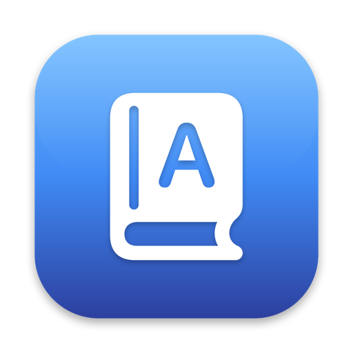

<p align="center">
  
</p>

<h1 align="center">Define</h1>

<p align="center"><strong>The built-in macOS dictionary, but it remembers.</strong></p>

Define is a tiny open-source menu bar app. Select a word in any app, press
**⌃⌘D** (the same shortcut as the system dictionary), and a popover shows the
definition — pulled offline from the same system dictionaries Apple's built-in
Look Up uses.

The difference: **every word you look up is saved**. Organize words into
folders — *Biology*, *French*, *GRE* — and export any folder straight to
[Anki](https://apps.ankiweb.net) as ready-to-study flashcards.

## Features

- **⌃⌘D anywhere** — intercepts the system Look Up shortcut (optional, can be
  turned off in Settings), or click the menu bar icon
- **Fully offline** — definitions come from the system dictionaries you've
  enabled in the Dictionary app; nothing ever leaves your Mac
- **Automatic history** — every lookup is saved, searchable, with lookup
  counts so you can see which words you keep forgetting
- **Folders** — file a word into one or more folders right from the
  definition popover
- **Anki export** — export a folder as a TSV file (with Anki `#deck`/`#html`
  headers) that imports as a deck in one step

## Install

**Download:** grab `Define.app.zip` from the
[latest release](https://github.com/daniel-inderos/Define/releases/latest),
unzip, and move `Define.app` to `/Applications`. Release builds aren't yet
notarized, so on first launch right-click the app and choose **Open** (or run
`xattr -d com.apple.quarantine /Applications/Define.app`).

**Or build from source** (requires Xcode 16+ / macOS 14+):

```sh
git clone https://github.com/daniel-inderos/Define.git && cd Define
make app        # builds and assembles ./build/Define.app
make run        # builds and launches it
```

On first launch, Define asks for **Accessibility access**
(System Settings → Privacy & Security → Accessibility). This is required to
read the word you've selected and to respond to ⌃⌘D globally. Define makes no
network connections — see [How it works](#how-it-works).

## Exporting to Anki

1. Open Define → **Folders** → pick a folder → **Export → Export for Anki…**
2. In Anki: **File → Import…** and choose the exported `.txt` file

The file declares its own separator, deck name, and HTML handling, so the
import needs no manual configuration. Terms go on the front, definitions on
the back.

## How it works

- **Definitions** come from `DCSCopyTextDefinition` (DictionaryServices), the
  public API over the system dictionaries — offline, no API keys. Enable more
  dictionaries (other languages, thesaurus) in the Dictionary app's settings
  and Define picks them up automatically.
- **Selection reading** uses the Accessibility API
  (`AXSelectedText`), falling back to a synthesized ⌘C with full clipboard
  save/restore for apps that don't expose their selection (some Electron
  apps, some browser views).
- **The hotkey** is a `CGEventTap` that swallows ⌃⌘D before the system
  popover sees it. Turn it off in Settings to keep the built-in behavior.
- **Storage** is a local SwiftData store in
  `~/Library/Application Support/Define/`.

No third-party dependencies. No analytics. No network.

## Development

```sh
swift build     # build
swift test      # run the test suite
make app        # assemble Define.app into ./build
```

Or open `Package.swift` in Xcode. Note that when running un-bundled
(`swift run` or Xcode), macOS tracks Accessibility permission per-binary, so
you may be re-prompted after rebuilds; the bundled `make app` build has a
stable identity.

See [CONTRIBUTING.md](CONTRIBUTING.md) for the lay of the land.

## Roadmap

- [ ] Choose which dictionaries to query / per-dictionary results
- [ ] Configurable hotkey
- [ ] At-cursor popover option (next to the selected word)
- [ ] `.apkg` export and AnkiConnect push
- [ ] Spaced-repetition review inside the app
- [ ] Homebrew cask + notarized releases

## License

[MIT](LICENSE)
